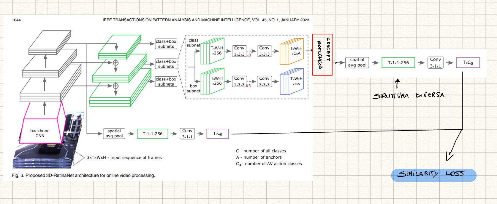

# XAI_Autonomous_Driving
As explained, to this purpose three different types of labels are introduced, namely: 
- the category of road agent involved (e.g., Pedestrian, Car, Bus,
Cyclist); 
- the type of action being performed by the agent
(e.g., Moving away, Moving towards, Crossing and so on)
- the location of the road user relative the autonomous
vehicle perceiving the scene (e.g., In vehicle lane, On right
pavement, In incoming lane). 

In addition, ROAD labels theactions performed by the vehicle itself. 

Multiple agents might be present at any given time, and each of them may perform multiple actions simultaneously (e.g., a Car may be
Indicating right while Turning right). Each agent is always
associated with at least one action label.

Retina Net id trained over 3 task of the ROAD dataset:
1. Agent detection: Active agent detection (or agent detection) aims at localising an active agent using a bounding box (framelevel) or a tube (video-level) and assigning a class
label to it.
2. Action detection: seeks to localise an active agent occupied in performing a specific action from the list of action classes.
3. Event detection
Road event detection (or event detection) consist in
assigning to each box or tube a triplet of class labels

# TODO
    - [] Read dataset ROAD paper, that explain the RETINAnet:
        - [x] Understand the task used for train the model:

    - [] Define a structure like in the image below

    - [] add the concept bottleneck to this structure.

    - [] temporal transformer with temporal series data

    Tips by Ciravegna.

    - [] Leggere bene paper ROAD & Understand 3d retina net (frames in input = 8 o 32, and in output)
    
    - [] Dove tagliare 3d retina net per inserire concept bottleneck
    - [] Capire come è formattato il dataset
    - [] Provare a fare inferenza con 3d retina net
    - [] Come gestire il bottleneck layer in modo che ci siano più agent, più action, più location (forse: agente * action * location)
    - [] Capire meglio come gestire modulo di memoria e temporal transformer
    - [] Explanation: come? Definire

    

   